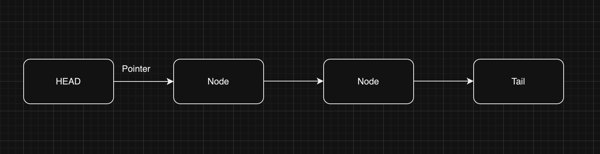

# My Understanding of Stacks
An implementation for understanding Stacks using javascript.

## Stacks
A Stack is a one-ended linear data structure which models a real world stack. It has two opearations push and pop. It follows The LIFO operation.

**Where are Stacks used?**
Stacks are used to make functionalities like undo, redo. They can be used to manage recursive function calls and return addresses. It can help in backtracking algorithms. It can be used to implement Depth First Search on a graph.

## Complexity
| Functions        | Complexity                     |
|-----------------------|--------------------------|
| **Pushing**| O(1) |
| **Popping**| O(1) |
| **Peeking**| O(1) |
| **Searching**| O(n) |
| **Size**| O(1) |

### Terminologies in Stack

**Head**: The first node in the linked list. 
**Tail**: The last node in the linked list. 
**Pointer**: The reference to the node. 
**Node**: The object containing data and pointers.

## Singly Linked List
A singly linked list is a linear data structure where each node points to the next node in the list.

Each node has two parts:
- **Data**: Stores the actual data of the node.
- **Next**: A reference or pointer to the next node in the list.

**Traversal**: You can only traverse the list in one direction, from the head (first node) to the last node.

### Memory:
Singly linked lists use **less memory** because each node only needs to store one reference (to the next node).

### Insertion and Deletion:
Insertion and deletion operations can be performed efficiently, especially at the beginning of the list.

---

## Doubly Linked List
A doubly linked list is a more complex version of a linked list where each node contains three parts:
- **Data**: Stores the actual data of the node.
- **Next**: A reference or pointer to the next node in the list.
- **Prev**: A reference or pointer to the previous node in the list.

**Traversal**: You can traverse the list in both directions: from the head to the tail and from the tail to the head.

### Memory:
Doubly linked lists use **more memory** because each node needs two pointers (one to the next node and one to the previous node).

### Insertion and Deletion:
Insertion and deletion operations can be more efficient than singly linked lists, especially when removing a node from the middle of the list, as you can directly access the previous node.

